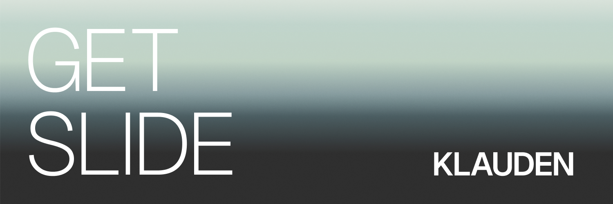

<a href="https://github.com/KKlauden/get-slide">
  
</a>

<br/>
<br/>

<div align="center">
    <strong>A 4-layer framework for AI to author HTML slide decks — single-file, 1920×1080, self-contained, full chrome runtime (presenter / overview / hash deep-link / preview / print).</strong>
    <br />
    <br />
</div>

<div align="center">

[](LICENSE)


</div>

# get-slide

## What it is

Split a PPT-style deck into **4 layers**:

| Layer | What it is | Files |
|---|---|---|
| framework | chrome runtime + design.md / content.md schema contracts | `skills/get-slide/framework/` |
| design | theme contract (atmosphere / palette / typography / shape / variants) | per-deck `<my-deck>/design.md` |
| content | deck outline (per-page content + chrome + notes) | per-deck `<my-deck>/content.md` |
| product | single-file `deck.html` artifact | per-deck `<my-deck>/<my-deck>.html` |

The AI workflow (iterative Pre-flight → streaming execution with checkpoints) lives in [`SKILL.md`](./skills/get-slide/SKILL.md) — auto-triggered when you ask the agent to build a deck.

## Install

This skill is just files — no build, no npm. Pick one path:

### Option A — Global (Claude Code, recommended)

Install once, works in every project:

```bash
git clone https://github.com/KKlauden/get-slide.git
mkdir -p ~/.claude/skills
cp -r get-slide/skills/get-slide ~/.claude/skills/get-slide
```

Restart Claude Code; the skill auto-discovers via SKILL.md frontmatter.

Update later: `cd get-slide && git pull && cp -r skills/get-slide ~/.claude/skills/`.

(Or symlink instead of cp: `ln -s "$PWD/get-slide/skills/get-slide" ~/.claude/skills/get-slide` — `git pull` then propagates without re-cp.)

### Option B — Project-local (per agent, or pinned version)

Each agent has its own project-local skill discovery path — `cp` the bundle to whichever path matches your agent. You can install to multiple paths if the project will be opened by different agents.

| Agent | Auto-discovers SKILL.md? | Project-local path |
|---|---|---|
| **Claude Code** | ✓ via SKILL.md frontmatter | `.claude/skills/get-slide/` |
| **Codex** | ✓ via SKILL.md frontmatter | `.codex/skills/get-slide/` |
| Cursor / Gemini / others | no native skill system | any path + protocol-file reference (see below) |

```bash
cd my-deck-project
git clone https://github.com/KKlauden/get-slide.git ../get-slide

# Claude Code:
mkdir -p .claude/skills && cp -r ../get-slide/skills/get-slide .claude/skills/get-slide

# Codex:
mkdir -p .codex/skills && cp -r ../get-slide/skills/get-slide .codex/skills/get-slide
```

Restart the agent after install — skills are loaded at session start.

For agents without native skill discovery (Cursor / Gemini / etc.), copy the bundle anywhere (e.g. `./skills/get-slide/`) and reference `SKILL.md` from your protocol file (`AGENTS.md` / `GEMINI.md` / `.cursor/rules/`):

```
When asked to build a slide deck, read ./skills/get-slide/SKILL.md and follow it.
```

## Build your first deck

Make a folder for your decks and run your AI agent from there — otherwise the AI will create deck folders wherever you happened to `cd`:

```bash
mkdir -p ~/decks && cd ~/decks
```

Then ask:

> Build me a deck about &lt;topic&gt;.

The skill auto-triggers, walks you through iterative Pre-flight (audience / decision context / outline / style / starting point), then writes `<my-deck>/design.md` + `content.md` + `<my-deck>.html`.

## Using a deck

Open `<my-deck>/<my-deck>.html` in any browser. Self-contained — no server, no build, no external CDN.

| Keys | Effect |
|---|---|
| ← → ↑ ↓ PgUp PgDn Space | page navigation |
| `1`–`9` | jump directly to page N |
| `F` | fullscreen / presenter mode |
| `S` | presenter window (NEXT slide / SCRIPT / TIMER cards) |
| `O` | overview grid |
| `Esc` | close overlay |
| `Cmd / Ctrl + P` | print to PDF — one slide per page |
| `?preview=N` URL parameter | single-page chrome-less mode (used by presenter iframe) |

Decks are **frozen snapshots** — re-running the skill won't update existing decks; only newly-generated ones pick up framework changes.

## Repo structure

```
get-slide/
├── README.md
├── LICENSE
└── skills/get-slide/      ← skill bundle (the distribution unit — cp this)
    ├── SKILL.md           ← skill canonical entry
    ├── framework/         ← chrome runtime + schema contracts
    ├── references/        ← on-demand pattern docs (charts/)
    └── samples/           ← reference case studies (pitch, archive)
```

## Design principles

1. **Single-file deck** — a deck is an archivable document, not a dynamic app
2. **Token names locked to shadcn** — avoids naming drift
3. **Chrome runtime is canonical** — every deck shares the same runtime
4. **`design.md` is the theme contract** — CSS is generated by §8; raw CSS does not live in `design.md` (except the §8 Append block)
5. **`content.md` is the content outline** — every page has 4 sub-blocks (block / variant / content / chrome / notes)

## License

[MIT](./LICENSE) © 2026 KKlauden.

Issues / contributions welcome — [GitHub Issues](https://github.com/KKlauden/get-slide/issues).
